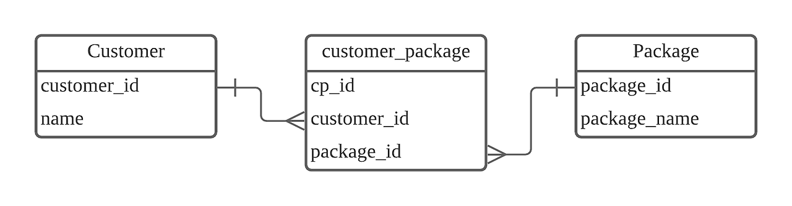

## 키워드 과제

<details>
    <summary>외래키</summary>

---

관계형 데이터베이스에서 외래 키(외부 키, Foreign Key)는 한 테이블의 필드(attribute) 중 다른 테이블의 행(row)을 식별할 수 있는 키를 말한다.

> 외래키는 두 개의 테이블을 연결해주는 다리 역할.

외래키가 포함된 테이블을 자식 테이블이라고 하고 외래키 값을 제공하는 테이블을 부모 테이블이라한다.

---

## 외래키 사용시 주의사항

1. 외래키 값은 NULL이거나 부모 테이블의 기본키 값과 동일해야한다. (참조 무결성 제약조건)

2. 부모 테이블의 기본키, 고유키를 외래키로 지정할 수 있다.

3. 부모 테이블의 기본키, 고유키가 여러개의 컬럼으로 이루어져 있다면 부모가 가진 기본키, 고유키 컬럼을 원하는 개수만큼 묶어서 외래키로 지정할 수 있다.

4) 외래키로 지정할 두 테이블의 필드는 같은 데이터 타입이어야 한다.

추가로, on Delete / on Update 옵션을 이용해 Cascade 설정 가능. (부모 삭제시 자식도 삭제
)

### 예시

```
create table department(
  	id int auto_increment primary key,
	name varchar(20) not null,
	code char(13) not null unique key
);

create table employee (
  	id int auto_increment primary key,
	name varchar(20) not null,
	code char(13) not null unique key,
	dept_id int,
	foreign key (dept_id) references department(id)
);
```

> 출처: [밤둘레 블로그](https://bamdule.tistory.com/45)

</details>

<details>
    <summary>기본키</summary>

---

기본 키(primary key)는 주 키 또는 프라이머리 키라고 하며, 관계형 데이터베이스에서 조(레코드)의 식별자로 이용하기에 가장 적합한 것을 관계 (테이블)마다 단 한 설계자에 의해 선택, 정의된 후보 키를 말한다. 유일 키는 0~1개 이상의 속성의 집합으로 볼 수 있다.

> 기본키(Primary Key)는 테이블을 대표하는 고유식별자로, 중복 불가·NULL을 불허한다.

모든 테이블 만들때마다 기본키를 만들어주자. => 데이터 중복을 방지해 일관성을 유지할 수 있을뿐 아니라 원하는 데이터를 보다 빠르게 찾을 수 있게 도와준다.

</details>

<details>
    <summary>ER 다이어그램</summary>

---

ERD(Entity Relationship Diagram)는 단어에서 의미하는 그대로 'Entity =개체' 와 'Relationship =관계'를 중점적으로 표시하는 다이어그램으로 구체화 하는 것을 말한다.

> ERD는 데이터베이스 구조를 한 눈에 알아보기 위해 그려놓는 다이어그램이다.

이렇게 ERD를 그리는것을 **개념적 설계**라고 한다.

추가로 ERD에는 표기법이 여러가지 있는데, 대표적으로 **IE표기법**과 **Barker표기법**이 있다. 아래 표기는 IE 표기법이다.


> 출처: [mong9_9's.log](https://velog.io/@mong9_s/DBRDBMS-5.-ER%EB%8B%A4%EC%9D%B4%EC%96%B4%EA%B7%B8%EB%9E%A8ERD)

</details>

<details>
    <summary>복합키</summary>

---

테이블에 한 개의 PK 만 존재할 수 있지만 조합키를 사용하면 두 개 이상의 컬럼을 하나의 PK 로 사용할 수 있다.

> 복합키는 두 개 이상의 컬럼을 PK 로 지정하는 것. 합성키, 조합키라고도 불린다.

### 예시

```
CREATE TABLE TBL_FLOWER(
	FLOWER_NAME VARCHAR2(1000),
	FLOWER_COLOR VARCHAR2(1000),
	FLOWER_PRICE NUMBER,
	CONSTRAINT PK_FLOWER PRIMARY KEY(FLOWER_NAME, FLOWER_COLOR)
);
```

### 복합키의 이점

- 데이터 무결성 보장: 복합키를 사용하면, 한 테이블 내의 특정 칼럼 조합의 고유성을 보장할 수 있습니다. 이를 통해 데이터 중복을 방지하고 무결성을 유지할 수 있습니다.

- 정규화: 복합키는 데이터베이스 설계의 정규화 과정에서 발생하는 테이블 간의 관계를 나타내는 데 유용하게 사용됩니다.

> 출처: [매일 쓰다보면 늘겠지](https://shin-e-dog.tistory.com/66)

</details>

<details>
    <summary>연관관계</summary>

---

> **연관관계**란 두 개 이상의 테이블 간에 존재하는 관계를 의미한다.

종류는 다음과 같다.

- 일 대 일 (1 to 1)
- 일 대 다 (1 to N)
- 다 대 일 (N to 1)
- 다 대 다(N to M)



N:M 관계는 중간에 매핑 테이블을 새롭게 만드는 방법으로 해소한다.

---

추가적으로, 자기 자신을 참조하는 **자기 참조 관계**도 있다고 한다.

때로는 하나의 테이블 내에서 관계를 표현해야 할 수도 있다. 예를 들어, 특정 서비스에서 회원 가입을 진행할 때, 추천인 ID를 입력하는 등의 기능에 사용된다.

User 테이블의 recommend_id는 같은 User 테이블의 user_id와 연결되어 있다.
한 명의 사용자(user_id)는 한 명의 추천인(recommend_id)을 가질 수 있다.

하지만 한 명의 추천인(recommend_id)은 여러 명의 사용자(user_id)에게 추천인으로 등록될 수 있다.

</details>

<details>
    <summary>정규화</summary>

---

정규화(Normalization)란 **데이터 중복**을 줄이고 **데이터 무결성**을 개선하기 위해 데이터를 정규형(normal form)에 맞도록 구조화하는 프로세스를 뜻한다.

> 쉽게 말해, 테이블 간의 중복 데이터를 줄이기 위해 테이블을 쪼개는 행위이다.

### 장점

1. 데이터 중복 감소

2) 데이터 무결성 보장 (일관성과 정확성 유지)

3) 저장 공간 효율화

4) 데이터베이스 성능 향상

### 단점

1. 복잡한 조인(Join) 쿼리

2) 성능 저하 가능성 (너무 많이 테이블 쪼개면 조인때매 더 성능 저하)

3) 설계와 관리의 복잡성 증가

4) 트랜잭션 처리의 복잡성

> => 결론적으로 최적의 정규화 수준을 결정하는것이 중요하다.

---

## 정규화 형태 (단계)

### 제 1 정규화

테이블의 컬럼이 원자값(Atomic Value, 하나의 값)을 갖도록 테이블을 분해하는 것.

(Before)


(After)


---

### 제 2 정규화

제2 정규화란 제1 정규화를 진행한 테이블에 대해 완전 함수 종속을 만족하도록 테이블을 분해하는 것이다.

> 여기서 함수 종속(FD)이란?<br>
> => 기본키의 부분집합이 결정자가 되지 않는 것을 완전 함수 종속이라 한다.

(Before)


위의 테이블에서 기본키가 (학생 번호, 강좌 이름) 두 개로 이뤄진 복합키라고 했을 때,

강좌 이름이라는 PK의 부분 집합이 강의실을 결정하는 강의실의 PK가 될 수 있다.

이러한 경우 강좌 이름과 강의실을 다른 테이블로 만들면, 강좌 이름과 강의실의 중복 데이터를 제거할 수 있다.

(After)


---

### 제 3 정규화

제3 정규화란 제2 정규화를 진행한 테이블에 대해 이행적 종속을 없애도록 테이블을 분해하는 것이다.

> 여기서 이행적 종속이란?<Br>
> => A -> B, B -> C가 성립할 때 A -> C가 성립되는 것을 의미한다.

(Before)


위와 같은 테이블이 존재할 때,

학생 번호가 강좌 이름을 결정하고, 강좌 이름은 수강료를 결정한다.

이 상황에서 501 학생이 강좌를 데이터베이스 -> 운영체제로 바꿨다고 할 때

강좌명만 변경하는 것이 아닌 수강료도 같이 변경해줘야 하는 불편함을 겪는다.

이러한 불편함을 해결하기 위해, 학생 번호와 강좌 이름으로 이뤄진 테이블 하나,
강좌 이름과 수강료로 이뤄진 테이블을 하나 만들어 제3 정규화를 진행하는 것이다.

(After)


---

### 일반적으로 제3 정규화까지만 진행하고 이 이상은 진행하지 않는다.

그 이유는 정규화가 너무 많이 진행될 경우

- 엔터티가 증가한다.
- 엔터티 사이의 관계가 증가한다.
- 데이터 조회시 조인이 늘어나, 조회 성능이 하락한다.

등의 문제가 발생하기에 보통 제3 정규형까지만 진행한다.

> 출처: [인성의 개발 공부 노트](https://superohinsung.tistory.com/111) / [MangKyu's Diary:티스토리](https://mangkyu.tistory.com/110)

</details>

<details>
    <summary>반 정규화</summary>

---

> 쉽게 말해, 쪼개진 테이블을 하나로 합치는 행위.

- 데이터베이스 조회 성능 향상을 위해서 데이터 중복을 허용하고 조인을 줄이는 방법이다.
- 반정규화는 조회 속도를 향상시키지만 데이터 모델의 유연성은 낮아진다.
- 반정규화는 데이터를 조회할 때 조인으로 인한 성능저하가 예상될 때 사용한다.

### 반정규화 기법들

테이블 병합

- 1:1 관계 테이블 병합 : 1:1 관계를 통합하여 성능향상
- 1:M 관계 테이블 병합 : 1:M 관계를 통합하여 성능향상

테이블 분할

- 수직분할 : 하나의 테이블의 속성을 분할하여 두 개 이상의 테이블로 분할
  - 컬럼 단위로 나눔.<br>
    예: 회원 테이블에서 개인정보(이름, 연락처)와 로그성 데이터(마지막 로그인, 접속기록)를 분리.<br>
    → 자주 쓰는 속성을 분리해 조회 효율성 확보.
- 수평분할 : 하나의 테이블에 있는 값을 기준으로 테이블을 분할(파티셔닝)
  - 레코드 단위로 나눔.<br>
    예: 주문 테이블을 연도별(2023주문, 2024주문)로 분리.<br>
    → 데이터가 많을 때 검색 속도 향상, 관리 편의.

테이블 추가

- 중복 테이블 추가 : 동일한 테이블 구조를 중복하여 원격조인을 제거
- 통계 테이블 추가 : SUM, AVG 등을 미리 수행하여 계산
- 이력 테이블 추가 : 마스터 테이블에서 자주 조회되는 레코드를 중복하여 테이블 추가
- 부분 테이블 추가 : 자주 이용하는 칼럼을 모아놓은 별도의 테이블 추가

> 정리하자면, **반정규화**는 자주 조회되는 테이블을 미리 만들거나 합쳐놔서 조회 성능을 높이는 기법이다.

> 출처: [ddooo9.log](https://velog.io/@dddooo9/%EB%8D%B0%EC%9D%B4%ED%84%B0%EB%B2%A0%EC%9D%B4%EC%8A%A4-%EB%B0%98%EC%A0%95%EA%B7%9C%ED%99%94)

</details>

---

> 출처: [위키백과 - 데이터베이스 관리 시스템](https://ko.wikipedia.org/wiki/%EB%8D%B0%EC%9D%B4%ED%84%B0%EB%B2%A0%EC%9D%B4%EC%8A%A4_%EA%B4%80%EB%A6%AC_%EC%8B%9C%EC%8A%A4%ED%85%9C) / [비전공자를 위한 SQL](https://brunch.co.kr/brunchbook/beginnersql)

실전에선 보통 어느 수준의 정규화로 DB를 설계해야하는지 궁금.
