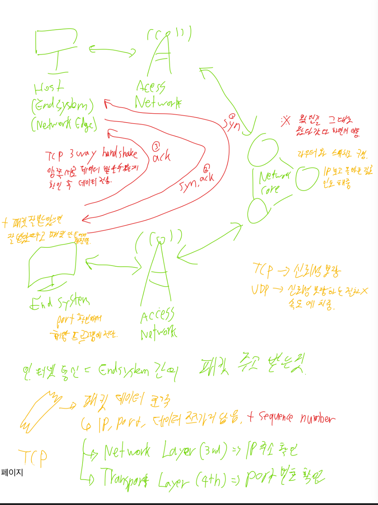

## 1. 너디너리 홈페이지 접속하는 과정 적어보기

(소켓프로그래밍과 같은 개념 없이 TCP, IP, PORT 등의 개념 등 오늘 배운 내용으로 간단하게 적어주세요)

1. 내 웹 브라우저에서 너디너리 (https://demoday.neordinary.co.kr/) 도메인으로 요청을 보냄. => DNS 서버에서 해당 도메인에 맞는 IP 주소를 연결해줌.

2. 내 웹 브라우저에서 해당 IP 주소에 TCP 연결을 시도 => 3 way handshake로 수신자 발신자 모두 요청을 받을 준비가 됐다는걸 확인.

3. 양측 모두 준비가 되었다면, 내 웹 브라우저에서 해당 IP로 HTTP GET 요청을 전송. 이때 HTTP 프로토콜이므로 Port는 80.

4. HTTP GET 요청을 받은 너디너리 사이트의 Web Server는 전달받은 포트로 맞는 프로세스를 찾고, 웹 브라우저에서 요청한 HTML, CSS, JS 파일을 전송. => 이떄 TCP/IP를 통해 패킷 단위로 데이터를 전달

4-1. 이때 Web Server 단에서만으론 처리가 불가능한 동적인 로직 요청이 들어오면, WebServer는 WAS로 해당 요청을 전달. (이를 Proxy라고 함.)

4-2. WAS는 해당 요청 패킷을 백엔드 프레임워크에게 전달. 백엔드 프레임워크는 로직에 맞춰 새로운 HTML 코드를 만들고 다시 WAS에서 해당 코드를 작동시킴.

4-3. 이렇게 동적으로 만들어진 새로운 컨텐츠를 다시 WAS에서 WebServer로 반환. WebServer는 이를 다시 웹 브라우저로 전달.

5. 해당 패킷을 전달받은 내 웹 브라우저는 전달받은 HTML CSS JS로 해당 페이지를 내 화면에 너디너리 사이트 화면을 그려줌.

> EndSystem(내 컴퓨터) - Access Network - Network Core - Access Network - EndSystem(너디너리 사이트 서버)

이 경로를 거쳐 내 웹 브라우저와 너디너리 사이트 서버, 즉 엔드시스템끼리 패킷을 주고 받음.  
**TCP는 신뢰성**을 보장하기에 패킷의 상태를 잘 전달됐는지 계속 확인하고, 혹시라도 문제가 생겼을시 수신자 서버에서 패킷을 새로 생성해 발신자 서버한테 다시 패킷 잘 보내달라고 전달함.  
이 경우에도 위 경로를 역순으로 돌아가서 전달함.꼭 경로를 거쳐야한다.

---

## 2. 깃허브 clone 받아서 실행하고 나온 페이지 스크린 샷 찍기

  
펼쳐보기

