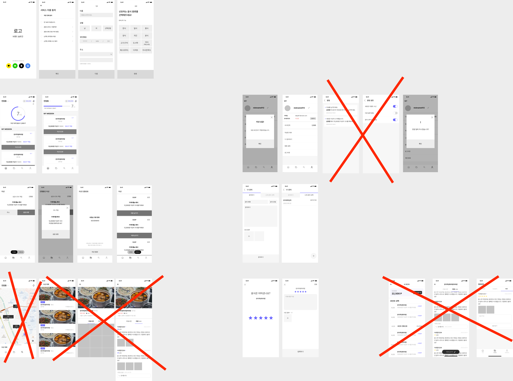
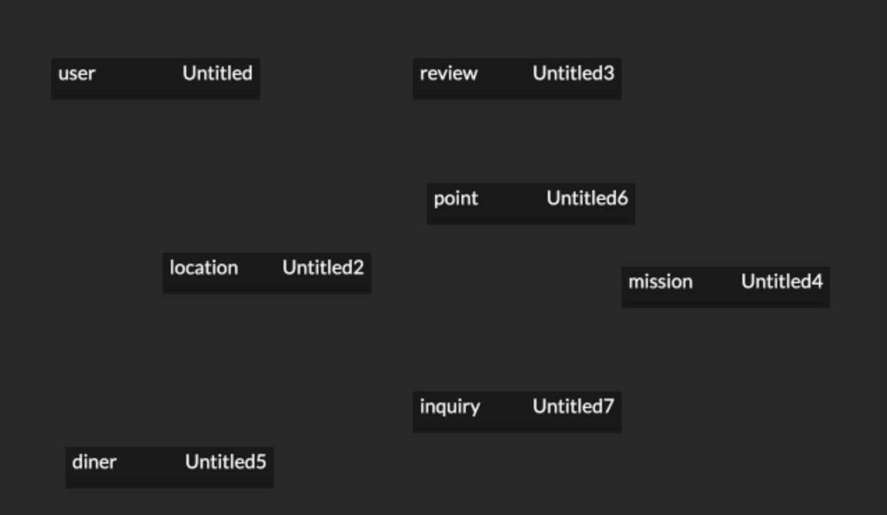
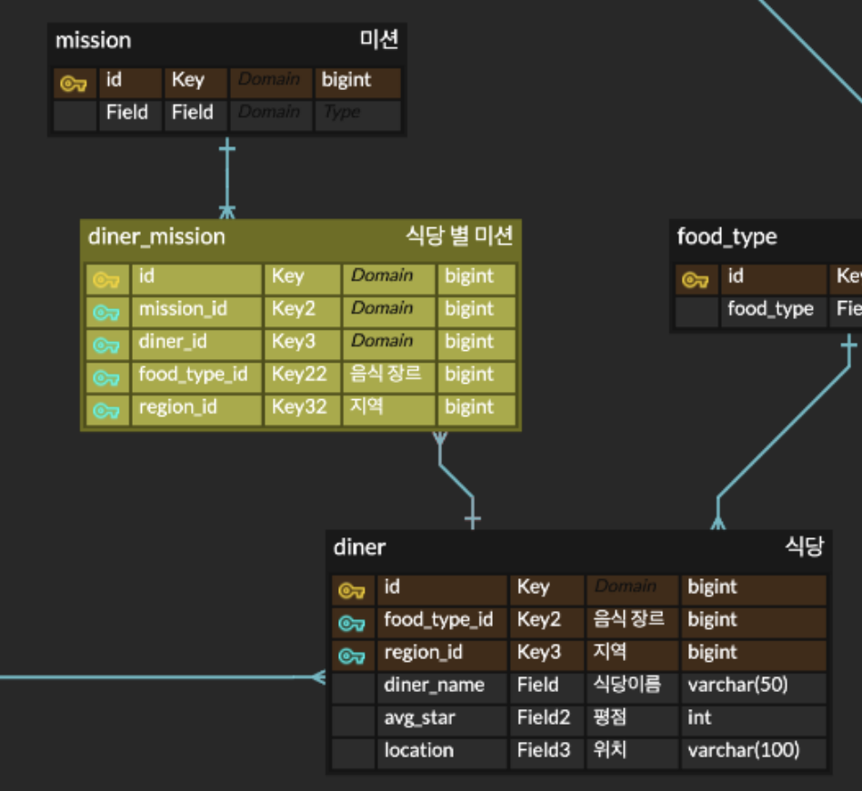
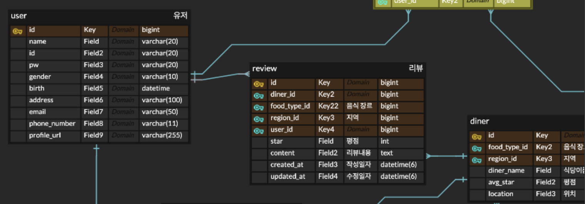
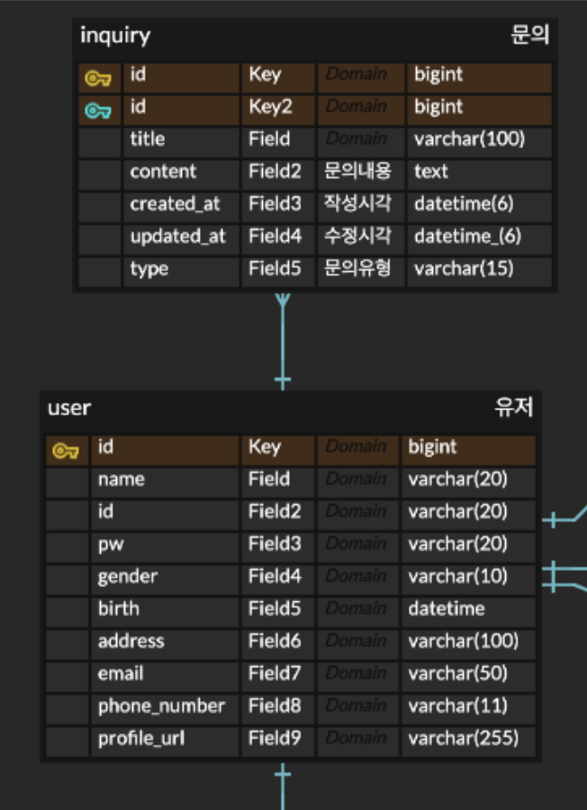
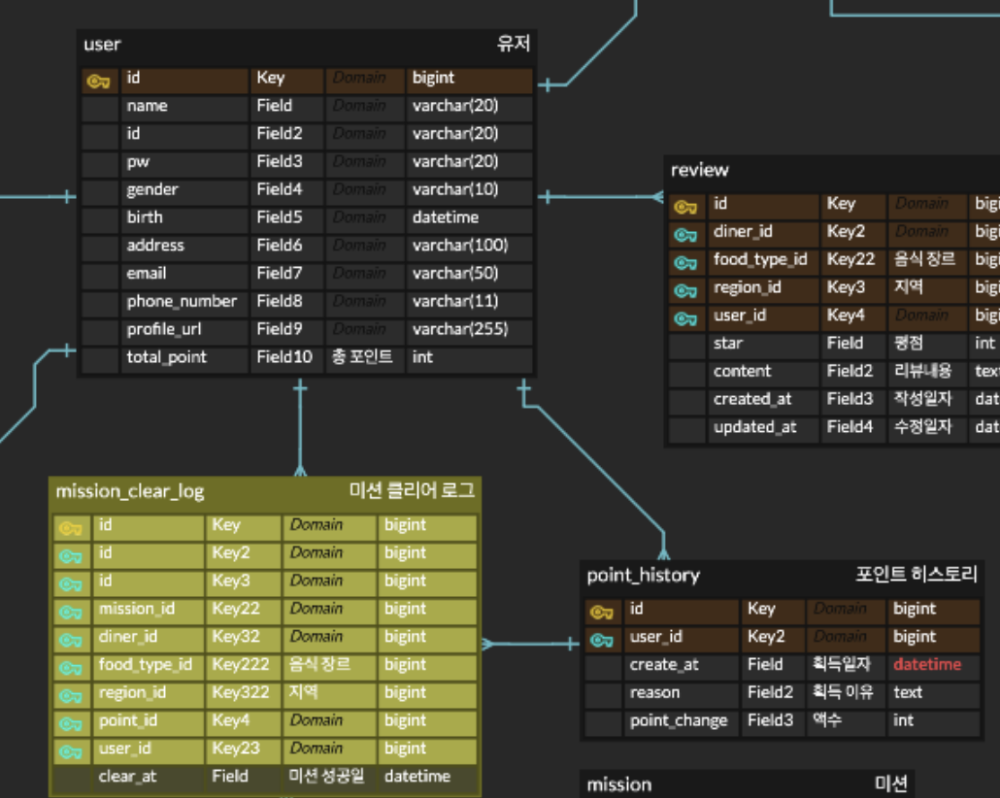
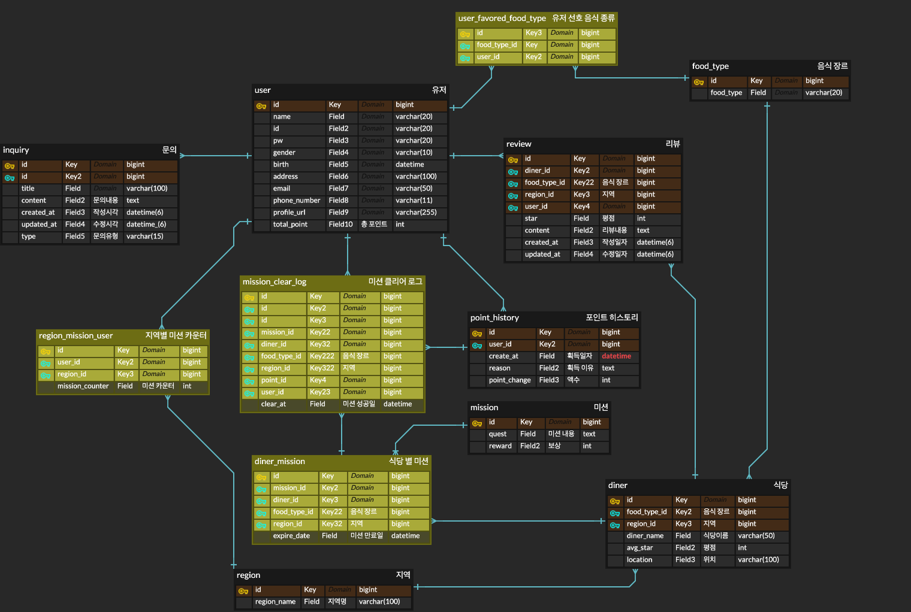

## 미션

1. 주어진 IA(기획 플로우)와 와이어 프레임(디자인 프로토타입)을 보고 직접 데이터베이스를 설계해오기, 위에서 언급한 경우를 다 적용해서 할 것
2. 이름 글자 수 등 세부적인 부분은 원하는 대로 해도 됨!
3. 각 지역 별로 가게들이 있으며 가게를 방문하는 미션을 해결하며 포인트를 모으는 서비스
   1. 모든 지역마다 10개의 미션 클리어시 1000 point 부여로 고정

**최소한 로그인/회원가입, 미션, 홈 화면에 필요한 데이터는 설계를 해야함, 되어있지 않다면 원 아웃**

**_미션 난이도 완화를 위해 지도 검색 기능 전부 pass, 저 부분은 설계 하지 마세요_**

**_내 포인트 관리, 알림 부분도 설계하지 마세요_**

**_사장님이 자신의 점포 관리하는 부분도 설계 대상에서 제외입니다._**

물론 원하시면 하셔도 됩니다. 😉

---

> 궁금한점: 사진은 어떻게 ERD에 표현?

---

(없앨거 없앤 버전)

릴레이션은 제외할거 제외해서 7개로 구성했다.  
포인트는 그냥 유저 테이블에 넣어도 되지만, 포인트 입출금 내역을 남기기 위해 따로 테이블을 만들어두었다.

---

유저 테이블 완성

유저는 선호 음식 종류를 고르는데 이는 중복 선택이 가능하다.
그래서 유저와 음식 종류는 N:M 관계. => 중간에 매핑 테이블을 만들어서 관계를 해소해줬다.

---

식당은 하나의 음식 장르만 가질 수 있다고 해석해서 이렇게 이었다.

---

지역마다 미션 카운트 -> 용현동 10개 / 숭의동 10개 이런 느낌? -> 각 지역에서 10개 미션 클리어시 1000포인트

유저가 여러 지역에 여러 미션 카운트를 할 수 있으니, 미션 카운트용 매핑 테이블을 만들었다.

---

보니까 미션 내용들이 중복되고, 식당만 바뀜(아직 와이퍼 프레임이라 식당은 안바뀐듯)

이렇게 하면 미션을 하나 만들어도 여러 식당의 미션으로 쓸 수 있고, 미션 수정시 기존 미션 하나만 수정 하면 돼서 관리가 편하다고 판단해서 이렇게 설계했다.

---

유저가 여러 가게에 리뷰를 달 수 있고, 가게는 여러 리뷰를 가질 수 있기에 유저와 가게 사이에 매핑 테이블로 리뷰 테이블을 두었다.

---

한 유저가 여러 문의를 할 수 있음.

---

포인트 히스토리를 만들어서 포인트를 언제 어디서 얻었는지 기록.
포인트 얻어온건 미션 클리어 로그 테이블에서 가져오고, 유저에서는 총 포인트를 가지고 있으면서 포인트 히스토리의 포인트 체인지로 총액을 업데이트.

추후에 포인트를 어디에 썼는지도 포인트 히스토리와 해당 테이블을 연결하는 방향으로 확장 가능하다.

---

# 최종본

